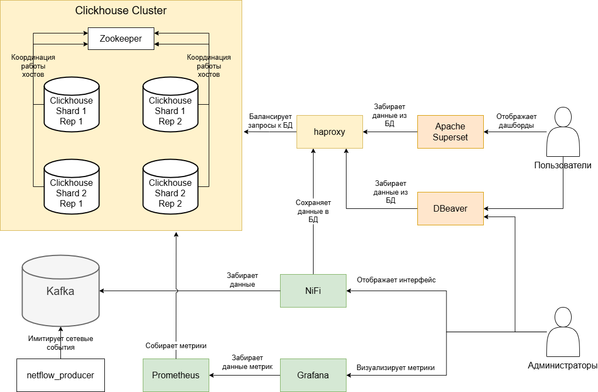

# Проектная работа на тему "Построение хранилища для онлайн аналитики траффика абонентов оператора связи"

Реализация проекта по созданию масштабируемого производственного хранилища данных на базе ClickHouse с интеграцией Apache Superset, Apache Kafka, Prometheus, Grafana и других компонентов. Ниже приведены конкретные цели реализации, подробное описание архитектуры с описанием всех контейнеров из docker-compose.

## Цели работы
- Обеспечить визуализацию траффика абонентов, получаемого с сетевого оборудования, с целью мониторинга производительности и безопасности сети
- Организовать взаимодействие между компонентами
    - Сервис netflow_producer, отправляющий в Kafka поток данных, имитирующих сбор данных с 6 узлов оператора связи
    - Apache Kafka
    - Кластер из 4 узлов Clickhouse + Zookeeper + haproxy
    - Apache NiFi, переливающий поток данных из Kafka в кластер NiFi
    - Prometheus + Grafana для мониторинга работы кластера Clickhouse
    - Среда развертывания - Docker Compose


## Установка и запуск

### Скачать и запустить проект

```sh
# Скачать репозиторий 
git clone https://github.com/ddmitry80/otus-clickhouse-project
# Скачать репозиторий с данными TelecomX 
cd otus-clickhouse-project/data
git clone https://github.com/ddmitry80/TelecomX
# Запустить проект
cd ..
docker compose up
```

### Создать необходимые структуры данных в кластере

```sh
docker compose exec -T clickhouse1 clickhouse-client -u default --password 123456 < sql/init_pipeline.sql
```

### Запускаем поток данных NiFi из Kafka в Clickhouse

Зайти в NiFi http://localhost:18443/nifi/, загрузить и активировать ProcessGroup `NetFlow2ClickHouse' из каталога nifi проекта.

### Конролировать процесс из DBeaver

- jdbc: `jdbc:clickhouse://localhost:8124`
- login: `default`
- password: `123456`

Пример запроса:
```sql
SELECT *
FROM dm.tc_netflow_v
WHERE endSession IS NOT NULL
ORDER BY startSession DESC
LIMIT 1000;
```

### Настраиваем отчетность в Apache Superset

#### Первоначальная настройка Superset

```sh
# Подключаемся к конейнеру
docker compose exec -it superset bash
# Следующие команды выполнить внутри контейнера
superset fab create-admin --username admin --firstname Superset --lastname Admin --email admin@superset.com --password admin
superset db upgrade
superset init
```

#### Подключение отчетов

Зайти http://localhost:8088/
- login: `admin'
- password: `admin'

Dasboards -> Import dashboards
Выбрать `superset/netflow_dashboard_export_?.zip`, указать пароль `123456`

Дашборд будет доступен в разделе Dashboards под именем NetFlow

### Мониторинг

#### Prometheus

Запускается автоматически. Доступен по http://localhost:9090/

#### Grafana

Запускается автоматически. Пароль по умолчанию admin/admin, далее потребуется сменить.

Точка входа http://localhost:3000

Рекомендованый конфиг grafana_14192_rev4.json.

Для настройки сначала подключаем prometheus: Connections -> Add new connection -> Prometheus -> Add new datasource. Connection url: http://prometheus:9090 -> Save & test

Далее - подключаем дашборд Clickhouse: Dashboards -> New -> Import -> указать содержимое файла `grafana_14192_rev4.json` -> Указать ранее подключенный Prometheus.

## Архитектура решения



Проект развернут на контейнеризованной среде Docker Compose

### Состав решения

#### Кластер Clickhouse

##### Clickhouse
- Базовый образ: `clickhouse:25.3.2.39-jammy`
- Назначение: основа кластера системы, в конфигурации с 2 шардами, каждый из которых имеет по 2 реплики. Образ кастомизирован установкой дополнительных пакетов, детали в `Dockerfile.clickhouse`

##### Zookeeper
- Базовый образ: `bitnami/zookeeper:3.9.3`
- Назначение: синхронизация состояния кластера Clickhouse

##### haproxy
- Базовый образ: `haproxy:3.1.7`
- Назначение: Балансировка нагрузки и обеспечение прозрачности для пользователей при подключении к кластеру Clickhouse

#### Kafka

##### Kafka
- Базовый образ: `apache/kafka:3.8.0`
- Назначение: брокер сообщений, обеспечивает передачу между компонентами решения. Используется упрощенный вариант, с одним сервисом, без организации кластера. В случае промышленного развертывания, следует использовать кластерное решение. В данной версии Zookeeper не задействуется.

##### kafka-ui
- Базовый образ: `provectuslabs/kafka-ui:v0.7.2`
- Назначение: возможность использовать базовые функции kafka через браузер, для удобства администратора

#### ETL
##### NiFi
- Базовый образ: `apache/nifi:1.27.0`
- Назначение: передача данных из Kafka в кластер Clickhouse, с минимумом преобразований

#### Мониторинг

##### Prometheus
- Базовый образ: `prom/prometheus:v2.53.4`
- Назначение: Сбор метрик с компонентов кластера Clickhouse, сохранение в собственной внутренней БД

##### Grafana
- Базовый образ: `grafana/grafana:11.5.2-ubuntu`
- Назначение: Визуализация метрик, сохраненных в БД Prometheus

#### BI система
##### Apache Superset
- Базовый образ: `apache/superset:4.1.2-dev`
- Назначение: Визуализация данных, хранящихся в кластере Clickhouse. Используется упрощенное развертывание, промышленный инстанс Superset состоит из набора контейнеров/сервисов. Образ кастомизирован установкой дополнительных пакетов, детали в `Dockerfile.superset`

#### Источник данных
##### netflow_producer
- Базовый образ: `ghcr.io/astral-sh/uv:python3.10-bookworm-slim`
- Сборка образа: Описана в Dockerfile.netflow_producer. Сервис написан на Python.
- Назначение: сервис имитирует потоки `netflow` от сетевого оборудования оператора связи, поступающие в реальном времени. Под капотом - читаются csv, txt файлы и их содержимое равномерно отправляется в Kafka. При этом временные метки внутри данных корректируются, имитируя "свежесть" данных.


  